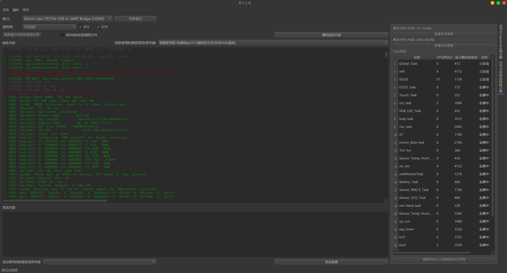

# SerialPortTool
一个灵活的串口工具

软件的主要目的是解决我工作中遇到的调试MCU或其他设备时从大量快速打印log中提取需要专注的重点信息.以及以多种方式编码发送或者解码接收串口数据.

本软件基于python构建

==========功能列表=========
基础的串口控制										[完成]
串口数据接收										[完成]
串口数据发送										[待做]
数据接收修饰器机制									[初步完成]
utf8编码文本解析数据接收修饰器  					[初步完成]
gb2312编码文本解析数据接收修饰器  					[初步完成]
hex编码文本解析数据接收修饰器  						[初步完成]
utf8编码文本(支持ANSI着色)解析数据接收修饰器  		[初步完成]
数据发送修饰器机制									[待做]
文本编码数据发送修饰器								[待做]
hex编码数据发送修饰器								[待做]
插件机制											[正在施工]
数据保存机制										[正在施工]
可设置的接收数据显示区								[完成]
ESP32的task信息插件									[完成]
ESP32的backtrace插件								[待做]
串口快捷发送与常用发送数据记录插件					[待做]

